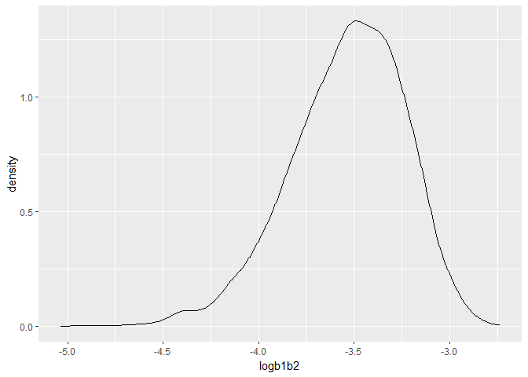
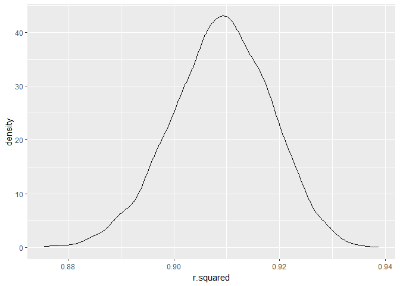
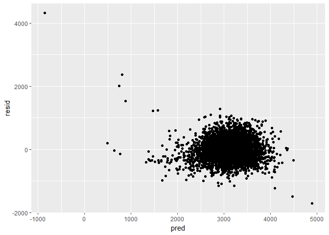
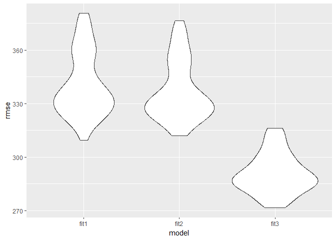

## R Markdown

This is an R Markdown document. Markdown is a simple formatting syntax
for authoring HTML, PDF, and MS Word documents. For more details on
using R Markdown see <http://rmarkdown.rstudio.com>.

When you click the **Knit** button a document will be generated that
includes both content as well as the output of any embedded R code
chunks within the document. You can embed an R code chunk like this:

``` r
summary(cars)
```

    ##      speed           dist       
    ##  Min.   : 4.0   Min.   :  2.00  
    ##  1st Qu.:12.0   1st Qu.: 26.00  
    ##  Median :15.0   Median : 36.00  
    ##  Mean   :15.4   Mean   : 42.98  
    ##  3rd Qu.:19.0   3rd Qu.: 56.00  
    ##  Max.   :25.0   Max.   :120.00

## Including Plots

You can also embed plots, for example:


Note that the `echo = FALSE` parameter was added to the code chunk to
prevent printing of the R code that generated the plot.

``` r
library(rnoaa)
library(dplyr)
library(purrr)
library(tidyr)
library(ggplot2)
library(gtsummary)
library(modelr)
library(forcats)
```

Problem 2

``` r
weather_df = 
  rnoaa::meteo_pull_monitors(
    c("USW00094728"),
    var = c("PRCP", "TMIN", "TMAX"), 
    date_min = "2022-01-01",
    date_max = "2022-12-31") |>
  mutate(
    name = recode(id, USW00094728 = "CentralPark_NY"),
    tmin = tmin / 10,
    tmax = tmax / 10) |>
  select(name, id, everything())
```

    ## using cached file: C:\Users\王子奇1\AppData\Local/R/cache/R/rnoaa/noaa_ghcnd/USW00094728.dly

    ## date created (size, mb): 2023-12-01 16:45:33.934471 (8.561)

    ## file min/max dates: 1869-01-01 / 2023-11-30

``` r
data1 <- weather_df |> 
  modelr::bootstrap(n = 5000) |> 
  mutate(
    models = map(strap, \(df) lm(tmax ~ tmin + prcp -1, data = df) ),
    results = map(models, broom::tidy),
    results2 = map(models, broom::glance))
 
 
data2 <- data1 |> 
   select(-strap, -models, -results2) |> 
   unnest(results) |> 
   select(.id, term, estimate) |> 
   filter(term %in% c("tmin", "prcp")) |>
   pivot_wider(names_from = term,
               values_from = estimate) |>
   mutate(logb1b2 = log(tmin*prcp)) |>
   select(logb1b2)
 
data3 <- data1 |> 
   select(-strap, -models, -results) |> 
   unnest(results2) |>
   select(r.squared)
 
data4 <- bind_cols(data2, data3)
```

``` r
quantile(data4$logb1b2, c(0.025, 0.975))
```

    ##      2.5%     97.5% 
    ## -4.193983 -3.028236

``` r
quantile(data4$r.squared, c(0.025, 0.975))
```

    ##      2.5%     97.5% 
    ## 0.8897206 0.9264202

``` r
ggplot(data4, aes(x = logb1b2)) +
  geom_density()
```



``` r
ggplot(data4, aes(x = r.squared)) +
  geom_density()
```



The density plot depicts the distribution of log(b1\*b2), The most value
is located around -3.5. The distribution is slightly left skewed. The
density plot of r2 seems that the values are normal distributed with
mean at 0.91.

Problem 3

``` r
dat <- read.csv("birthweight.csv")
```

``` r
dat.1 <- dat %>% 
         mutate(babysex = factor(babysex, levels = c(1,2), labels = c("male", "female")),
                frace = factor(frace, levels = c(1,2,3,4,8,9), labels = c("White", "Black", "Asian", "Puerto Rican", "Other", "Unknown")),
                malform = factor(malform, levels = c(0, 1), labels = c("absent", "present")),
                mrace = factor(mrace, levels = c(1,2,3,4,8), labels = c("White", "Black", "Asian", "Puerto Rican", "Other")))

dat.2 <- dat.1 %>% na.omit()
```

``` r
  tbl_uvregression(
    dat.2,
    method = lm,
    y = bwt
  )
```

<div id="cbmjjavmbe" style="padding-left:0px;padding-right:0px;padding-top:10px;padding-bottom:10px;overflow-x:auto;overflow-y:auto;width:auto;height:auto;">
<style>#cbmjjavmbe table {
  font-family: system-ui, 'Segoe UI', Roboto, Helvetica, Arial, sans-serif, 'Apple Color Emoji', 'Segoe UI Emoji', 'Segoe UI Symbol', 'Noto Color Emoji';
  -webkit-font-smoothing: antialiased;
  -moz-osx-font-smoothing: grayscale;
}

#cbmjjavmbe thead, #cbmjjavmbe tbody, #cbmjjavmbe tfoot, #cbmjjavmbe tr, #cbmjjavmbe td, #cbmjjavmbe th {
  border-style: none;
}

#cbmjjavmbe p {
  margin: 0;
  padding: 0;
}

#cbmjjavmbe .gt_table {
  display: table;
  border-collapse: collapse;
  line-height: normal;
  margin-left: auto;
  margin-right: auto;
  color: #333333;
  font-size: 16px;
  font-weight: normal;
  font-style: normal;
  background-color: #FFFFFF;
  width: auto;
  border-top-style: solid;
  border-top-width: 2px;
  border-top-color: #A8A8A8;
  border-right-style: none;
  border-right-width: 2px;
  border-right-color: #D3D3D3;
  border-bottom-style: solid;
  border-bottom-width: 2px;
  border-bottom-color: #A8A8A8;
  border-left-style: none;
  border-left-width: 2px;
  border-left-color: #D3D3D3;
}

#cbmjjavmbe .gt_caption {
  padding-top: 4px;
  padding-bottom: 4px;
}

#cbmjjavmbe .gt_title {
  color: #333333;
  font-size: 125%;
  font-weight: initial;
  padding-top: 4px;
  padding-bottom: 4px;
  padding-left: 5px;
  padding-right: 5px;
  border-bottom-color: #FFFFFF;
  border-bottom-width: 0;
}

#cbmjjavmbe .gt_subtitle {
  color: #333333;
  font-size: 85%;
  font-weight: initial;
  padding-top: 3px;
  padding-bottom: 5px;
  padding-left: 5px;
  padding-right: 5px;
  border-top-color: #FFFFFF;
  border-top-width: 0;
}

#cbmjjavmbe .gt_heading {
  background-color: #FFFFFF;
  text-align: center;
  border-bottom-color: #FFFFFF;
  border-left-style: none;
  border-left-width: 1px;
  border-left-color: #D3D3D3;
  border-right-style: none;
  border-right-width: 1px;
  border-right-color: #D3D3D3;
}

#cbmjjavmbe .gt_bottom_border {
  border-bottom-style: solid;
  border-bottom-width: 2px;
  border-bottom-color: #D3D3D3;
}

#cbmjjavmbe .gt_col_headings {
  border-top-style: solid;
  border-top-width: 2px;
  border-top-color: #D3D3D3;
  border-bottom-style: solid;
  border-bottom-width: 2px;
  border-bottom-color: #D3D3D3;
  border-left-style: none;
  border-left-width: 1px;
  border-left-color: #D3D3D3;
  border-right-style: none;
  border-right-width: 1px;
  border-right-color: #D3D3D3;
}

#cbmjjavmbe .gt_col_heading {
  color: #333333;
  background-color: #FFFFFF;
  font-size: 100%;
  font-weight: normal;
  text-transform: inherit;
  border-left-style: none;
  border-left-width: 1px;
  border-left-color: #D3D3D3;
  border-right-style: none;
  border-right-width: 1px;
  border-right-color: #D3D3D3;
  vertical-align: bottom;
  padding-top: 5px;
  padding-bottom: 6px;
  padding-left: 5px;
  padding-right: 5px;
  overflow-x: hidden;
}

#cbmjjavmbe .gt_column_spanner_outer {
  color: #333333;
  background-color: #FFFFFF;
  font-size: 100%;
  font-weight: normal;
  text-transform: inherit;
  padding-top: 0;
  padding-bottom: 0;
  padding-left: 4px;
  padding-right: 4px;
}

#cbmjjavmbe .gt_column_spanner_outer:first-child {
  padding-left: 0;
}

#cbmjjavmbe .gt_column_spanner_outer:last-child {
  padding-right: 0;
}

#cbmjjavmbe .gt_column_spanner {
  border-bottom-style: solid;
  border-bottom-width: 2px;
  border-bottom-color: #D3D3D3;
  vertical-align: bottom;
  padding-top: 5px;
  padding-bottom: 5px;
  overflow-x: hidden;
  display: inline-block;
  width: 100%;
}

#cbmjjavmbe .gt_spanner_row {
  border-bottom-style: hidden;
}

#cbmjjavmbe .gt_group_heading {
  padding-top: 8px;
  padding-bottom: 8px;
  padding-left: 5px;
  padding-right: 5px;
  color: #333333;
  background-color: #FFFFFF;
  font-size: 100%;
  font-weight: initial;
  text-transform: inherit;
  border-top-style: solid;
  border-top-width: 2px;
  border-top-color: #D3D3D3;
  border-bottom-style: solid;
  border-bottom-width: 2px;
  border-bottom-color: #D3D3D3;
  border-left-style: none;
  border-left-width: 1px;
  border-left-color: #D3D3D3;
  border-right-style: none;
  border-right-width: 1px;
  border-right-color: #D3D3D3;
  vertical-align: middle;
  text-align: left;
}

#cbmjjavmbe .gt_empty_group_heading {
  padding: 0.5px;
  color: #333333;
  background-color: #FFFFFF;
  font-size: 100%;
  font-weight: initial;
  border-top-style: solid;
  border-top-width: 2px;
  border-top-color: #D3D3D3;
  border-bottom-style: solid;
  border-bottom-width: 2px;
  border-bottom-color: #D3D3D3;
  vertical-align: middle;
}

#cbmjjavmbe .gt_from_md > :first-child {
  margin-top: 0;
}

#cbmjjavmbe .gt_from_md > :last-child {
  margin-bottom: 0;
}

#cbmjjavmbe .gt_row {
  padding-top: 8px;
  padding-bottom: 8px;
  padding-left: 5px;
  padding-right: 5px;
  margin: 10px;
  border-top-style: solid;
  border-top-width: 1px;
  border-top-color: #D3D3D3;
  border-left-style: none;
  border-left-width: 1px;
  border-left-color: #D3D3D3;
  border-right-style: none;
  border-right-width: 1px;
  border-right-color: #D3D3D3;
  vertical-align: middle;
  overflow-x: hidden;
}

#cbmjjavmbe .gt_stub {
  color: #333333;
  background-color: #FFFFFF;
  font-size: 100%;
  font-weight: initial;
  text-transform: inherit;
  border-right-style: solid;
  border-right-width: 2px;
  border-right-color: #D3D3D3;
  padding-left: 5px;
  padding-right: 5px;
}

#cbmjjavmbe .gt_stub_row_group {
  color: #333333;
  background-color: #FFFFFF;
  font-size: 100%;
  font-weight: initial;
  text-transform: inherit;
  border-right-style: solid;
  border-right-width: 2px;
  border-right-color: #D3D3D3;
  padding-left: 5px;
  padding-right: 5px;
  vertical-align: top;
}

#cbmjjavmbe .gt_row_group_first td {
  border-top-width: 2px;
}

#cbmjjavmbe .gt_row_group_first th {
  border-top-width: 2px;
}

#cbmjjavmbe .gt_summary_row {
  color: #333333;
  background-color: #FFFFFF;
  text-transform: inherit;
  padding-top: 8px;
  padding-bottom: 8px;
  padding-left: 5px;
  padding-right: 5px;
}

#cbmjjavmbe .gt_first_summary_row {
  border-top-style: solid;
  border-top-color: #D3D3D3;
}

#cbmjjavmbe .gt_first_summary_row.thick {
  border-top-width: 2px;
}

#cbmjjavmbe .gt_last_summary_row {
  padding-top: 8px;
  padding-bottom: 8px;
  padding-left: 5px;
  padding-right: 5px;
  border-bottom-style: solid;
  border-bottom-width: 2px;
  border-bottom-color: #D3D3D3;
}

#cbmjjavmbe .gt_grand_summary_row {
  color: #333333;
  background-color: #FFFFFF;
  text-transform: inherit;
  padding-top: 8px;
  padding-bottom: 8px;
  padding-left: 5px;
  padding-right: 5px;
}

#cbmjjavmbe .gt_first_grand_summary_row {
  padding-top: 8px;
  padding-bottom: 8px;
  padding-left: 5px;
  padding-right: 5px;
  border-top-style: double;
  border-top-width: 6px;
  border-top-color: #D3D3D3;
}

#cbmjjavmbe .gt_last_grand_summary_row_top {
  padding-top: 8px;
  padding-bottom: 8px;
  padding-left: 5px;
  padding-right: 5px;
  border-bottom-style: double;
  border-bottom-width: 6px;
  border-bottom-color: #D3D3D3;
}

#cbmjjavmbe .gt_striped {
  background-color: rgba(128, 128, 128, 0.05);
}

#cbmjjavmbe .gt_table_body {
  border-top-style: solid;
  border-top-width: 2px;
  border-top-color: #D3D3D3;
  border-bottom-style: solid;
  border-bottom-width: 2px;
  border-bottom-color: #D3D3D3;
}

#cbmjjavmbe .gt_footnotes {
  color: #333333;
  background-color: #FFFFFF;
  border-bottom-style: none;
  border-bottom-width: 2px;
  border-bottom-color: #D3D3D3;
  border-left-style: none;
  border-left-width: 2px;
  border-left-color: #D3D3D3;
  border-right-style: none;
  border-right-width: 2px;
  border-right-color: #D3D3D3;
}

#cbmjjavmbe .gt_footnote {
  margin: 0px;
  font-size: 90%;
  padding-top: 4px;
  padding-bottom: 4px;
  padding-left: 5px;
  padding-right: 5px;
}

#cbmjjavmbe .gt_sourcenotes {
  color: #333333;
  background-color: #FFFFFF;
  border-bottom-style: none;
  border-bottom-width: 2px;
  border-bottom-color: #D3D3D3;
  border-left-style: none;
  border-left-width: 2px;
  border-left-color: #D3D3D3;
  border-right-style: none;
  border-right-width: 2px;
  border-right-color: #D3D3D3;
}

#cbmjjavmbe .gt_sourcenote {
  font-size: 90%;
  padding-top: 4px;
  padding-bottom: 4px;
  padding-left: 5px;
  padding-right: 5px;
}

#cbmjjavmbe .gt_left {
  text-align: left;
}

#cbmjjavmbe .gt_center {
  text-align: center;
}

#cbmjjavmbe .gt_right {
  text-align: right;
  font-variant-numeric: tabular-nums;
}

#cbmjjavmbe .gt_font_normal {
  font-weight: normal;
}

#cbmjjavmbe .gt_font_bold {
  font-weight: bold;
}

#cbmjjavmbe .gt_font_italic {
  font-style: italic;
}

#cbmjjavmbe .gt_super {
  font-size: 65%;
}

#cbmjjavmbe .gt_footnote_marks {
  font-size: 75%;
  vertical-align: 0.4em;
  position: initial;
}

#cbmjjavmbe .gt_asterisk {
  font-size: 100%;
  vertical-align: 0;
}

#cbmjjavmbe .gt_indent_1 {
  text-indent: 5px;
}

#cbmjjavmbe .gt_indent_2 {
  text-indent: 10px;
}

#cbmjjavmbe .gt_indent_3 {
  text-indent: 15px;
}

#cbmjjavmbe .gt_indent_4 {
  text-indent: 20px;
}

#cbmjjavmbe .gt_indent_5 {
  text-indent: 25px;
}
</style>
<table class="gt_table" data-quarto-disable-processing="false" data-quarto-bootstrap="false">
  <thead>
    
    <tr class="gt_col_headings">
      <th class="gt_col_heading gt_columns_bottom_border gt_left" rowspan="1" colspan="1" scope="col" id="&lt;strong&gt;Characteristic&lt;/strong&gt;"><strong>Characteristic</strong></th>
      <th class="gt_col_heading gt_columns_bottom_border gt_center" rowspan="1" colspan="1" scope="col" id="&lt;strong&gt;N&lt;/strong&gt;"><strong>N</strong></th>
      <th class="gt_col_heading gt_columns_bottom_border gt_center" rowspan="1" colspan="1" scope="col" id="&lt;strong&gt;Beta&lt;/strong&gt;"><strong>Beta</strong></th>
      <th class="gt_col_heading gt_columns_bottom_border gt_center" rowspan="1" colspan="1" scope="col" id="&lt;strong&gt;95% CI&lt;/strong&gt;&lt;span class=&quot;gt_footnote_marks&quot; style=&quot;white-space:nowrap;font-style:italic;font-weight:normal;&quot;&gt;&lt;sup&gt;1&lt;/sup&gt;&lt;/span&gt;"><strong>95% CI</strong><span class="gt_footnote_marks" style="white-space:nowrap;font-style:italic;font-weight:normal;"><sup>1</sup></span></th>
      <th class="gt_col_heading gt_columns_bottom_border gt_center" rowspan="1" colspan="1" scope="col" id="&lt;strong&gt;p-value&lt;/strong&gt;"><strong>p-value</strong></th>
    </tr>
  </thead>
  <tbody class="gt_table_body">
    <tr><td headers="label" class="gt_row gt_left">babysex</td>
<td headers="stat_n" class="gt_row gt_center">4,342</td>
<td headers="estimate" class="gt_row gt_center"><br /></td>
<td headers="ci" class="gt_row gt_center"><br /></td>
<td headers="p.value" class="gt_row gt_center"><br /></td></tr>
    <tr><td headers="label" class="gt_row gt_left">    male</td>
<td headers="stat_n" class="gt_row gt_center"><br /></td>
<td headers="estimate" class="gt_row gt_center">—</td>
<td headers="ci" class="gt_row gt_center">—</td>
<td headers="p.value" class="gt_row gt_center"><br /></td></tr>
    <tr><td headers="label" class="gt_row gt_left">    female</td>
<td headers="stat_n" class="gt_row gt_center"><br /></td>
<td headers="estimate" class="gt_row gt_center">-89</td>
<td headers="ci" class="gt_row gt_center">-119, -58</td>
<td headers="p.value" class="gt_row gt_center"><0.001</td></tr>
    <tr><td headers="label" class="gt_row gt_left">bhead</td>
<td headers="stat_n" class="gt_row gt_center">4,342</td>
<td headers="estimate" class="gt_row gt_center">236</td>
<td headers="ci" class="gt_row gt_center">230, 242</td>
<td headers="p.value" class="gt_row gt_center"><0.001</td></tr>
    <tr><td headers="label" class="gt_row gt_left">blength</td>
<td headers="stat_n" class="gt_row gt_center">4,342</td>
<td headers="estimate" class="gt_row gt_center">140</td>
<td headers="ci" class="gt_row gt_center">136, 144</td>
<td headers="p.value" class="gt_row gt_center"><0.001</td></tr>
    <tr><td headers="label" class="gt_row gt_left">delwt</td>
<td headers="stat_n" class="gt_row gt_center">4,342</td>
<td headers="estimate" class="gt_row gt_center">6.6</td>
<td headers="ci" class="gt_row gt_center">6.0, 7.3</td>
<td headers="p.value" class="gt_row gt_center"><0.001</td></tr>
    <tr><td headers="label" class="gt_row gt_left">fincome</td>
<td headers="stat_n" class="gt_row gt_center">4,342</td>
<td headers="estimate" class="gt_row gt_center">3.0</td>
<td headers="ci" class="gt_row gt_center">2.5, 3.6</td>
<td headers="p.value" class="gt_row gt_center"><0.001</td></tr>
    <tr><td headers="label" class="gt_row gt_left">frace</td>
<td headers="stat_n" class="gt_row gt_center">4,342</td>
<td headers="estimate" class="gt_row gt_center"><br /></td>
<td headers="ci" class="gt_row gt_center"><br /></td>
<td headers="p.value" class="gt_row gt_center"><br /></td></tr>
    <tr><td headers="label" class="gt_row gt_left">    White</td>
<td headers="stat_n" class="gt_row gt_center"><br /></td>
<td headers="estimate" class="gt_row gt_center">—</td>
<td headers="ci" class="gt_row gt_center">—</td>
<td headers="p.value" class="gt_row gt_center"><br /></td></tr>
    <tr><td headers="label" class="gt_row gt_left">    Black</td>
<td headers="stat_n" class="gt_row gt_center"><br /></td>
<td headers="estimate" class="gt_row gt_center">-314</td>
<td headers="ci" class="gt_row gt_center">-344, -283</td>
<td headers="p.value" class="gt_row gt_center"><0.001</td></tr>
    <tr><td headers="label" class="gt_row gt_left">    Asian</td>
<td headers="stat_n" class="gt_row gt_center"><br /></td>
<td headers="estimate" class="gt_row gt_center">-106</td>
<td headers="ci" class="gt_row gt_center">-249, 37</td>
<td headers="p.value" class="gt_row gt_center">0.15</td></tr>
    <tr><td headers="label" class="gt_row gt_left">    Puerto Rican</td>
<td headers="stat_n" class="gt_row gt_center"><br /></td>
<td headers="estimate" class="gt_row gt_center">-204</td>
<td headers="ci" class="gt_row gt_center">-268, -140</td>
<td headers="p.value" class="gt_row gt_center"><0.001</td></tr>
    <tr><td headers="label" class="gt_row gt_left">    Other</td>
<td headers="stat_n" class="gt_row gt_center"><br /></td>
<td headers="estimate" class="gt_row gt_center">-89</td>
<td headers="ci" class="gt_row gt_center">-346, 169</td>
<td headers="p.value" class="gt_row gt_center">0.5</td></tr>
    <tr><td headers="label" class="gt_row gt_left">gaweeks</td>
<td headers="stat_n" class="gt_row gt_center">4,342</td>
<td headers="estimate" class="gt_row gt_center">67</td>
<td headers="ci" class="gt_row gt_center">63, 71</td>
<td headers="p.value" class="gt_row gt_center"><0.001</td></tr>
    <tr><td headers="label" class="gt_row gt_left">malform</td>
<td headers="stat_n" class="gt_row gt_center">4,342</td>
<td headers="estimate" class="gt_row gt_center"><br /></td>
<td headers="ci" class="gt_row gt_center"><br /></td>
<td headers="p.value" class="gt_row gt_center"><br /></td></tr>
    <tr><td headers="label" class="gt_row gt_left">    absent</td>
<td headers="stat_n" class="gt_row gt_center"><br /></td>
<td headers="estimate" class="gt_row gt_center">—</td>
<td headers="ci" class="gt_row gt_center">—</td>
<td headers="p.value" class="gt_row gt_center"><br /></td></tr>
    <tr><td headers="label" class="gt_row gt_left">    present</td>
<td headers="stat_n" class="gt_row gt_center"><br /></td>
<td headers="estimate" class="gt_row gt_center">12</td>
<td headers="ci" class="gt_row gt_center">-248, 271</td>
<td headers="p.value" class="gt_row gt_center">>0.9</td></tr>
    <tr><td headers="label" class="gt_row gt_left">menarche</td>
<td headers="stat_n" class="gt_row gt_center">4,342</td>
<td headers="estimate" class="gt_row gt_center">-8.5</td>
<td headers="ci" class="gt_row gt_center">-19, 1.8</td>
<td headers="p.value" class="gt_row gt_center">0.11</td></tr>
    <tr><td headers="label" class="gt_row gt_left">mheight</td>
<td headers="stat_n" class="gt_row gt_center">4,342</td>
<td headers="estimate" class="gt_row gt_center">37</td>
<td headers="ci" class="gt_row gt_center">31, 43</td>
<td headers="p.value" class="gt_row gt_center"><0.001</td></tr>
    <tr><td headers="label" class="gt_row gt_left">momage</td>
<td headers="stat_n" class="gt_row gt_center">4,342</td>
<td headers="estimate" class="gt_row gt_center">18</td>
<td headers="ci" class="gt_row gt_center">14, 22</td>
<td headers="p.value" class="gt_row gt_center"><0.001</td></tr>
    <tr><td headers="label" class="gt_row gt_left">mrace</td>
<td headers="stat_n" class="gt_row gt_center">4,342</td>
<td headers="estimate" class="gt_row gt_center"><br /></td>
<td headers="ci" class="gt_row gt_center"><br /></td>
<td headers="p.value" class="gt_row gt_center"><br /></td></tr>
    <tr><td headers="label" class="gt_row gt_left">    White</td>
<td headers="stat_n" class="gt_row gt_center"><br /></td>
<td headers="estimate" class="gt_row gt_center">—</td>
<td headers="ci" class="gt_row gt_center">—</td>
<td headers="p.value" class="gt_row gt_center"><br /></td></tr>
    <tr><td headers="label" class="gt_row gt_left">    Black</td>
<td headers="stat_n" class="gt_row gt_center"><br /></td>
<td headers="estimate" class="gt_row gt_center">-317</td>
<td headers="ci" class="gt_row gt_center">-347, -286</td>
<td headers="p.value" class="gt_row gt_center"><0.001</td></tr>
    <tr><td headers="label" class="gt_row gt_left">    Asian</td>
<td headers="stat_n" class="gt_row gt_center"><br /></td>
<td headers="estimate" class="gt_row gt_center">-126</td>
<td headers="ci" class="gt_row gt_center">-274, 21</td>
<td headers="p.value" class="gt_row gt_center">0.093</td></tr>
    <tr><td headers="label" class="gt_row gt_left">    Puerto Rican</td>
<td headers="stat_n" class="gt_row gt_center"><br /></td>
<td headers="estimate" class="gt_row gt_center">-211</td>
<td headers="ci" class="gt_row gt_center">-276, -146</td>
<td headers="p.value" class="gt_row gt_center"><0.001</td></tr>
    <tr><td headers="label" class="gt_row gt_left">parity</td>
<td headers="stat_n" class="gt_row gt_center">4,342</td>
<td headers="estimate" class="gt_row gt_center">-42</td>
<td headers="ci" class="gt_row gt_center">-190, 106</td>
<td headers="p.value" class="gt_row gt_center">0.6</td></tr>
    <tr><td headers="label" class="gt_row gt_left">pnumlbw</td>
<td headers="stat_n" class="gt_row gt_center">4,342</td>
<td headers="estimate" class="gt_row gt_center"><br /></td>
<td headers="ci" class="gt_row gt_center"><br /></td>
<td headers="p.value" class="gt_row gt_center"><br /></td></tr>
    <tr><td headers="label" class="gt_row gt_left">pnumsga</td>
<td headers="stat_n" class="gt_row gt_center">4,342</td>
<td headers="estimate" class="gt_row gt_center"><br /></td>
<td headers="ci" class="gt_row gt_center"><br /></td>
<td headers="p.value" class="gt_row gt_center"><br /></td></tr>
    <tr><td headers="label" class="gt_row gt_left">ppbmi</td>
<td headers="stat_n" class="gt_row gt_center">4,342</td>
<td headers="estimate" class="gt_row gt_center">15</td>
<td headers="ci" class="gt_row gt_center">10, 20</td>
<td headers="p.value" class="gt_row gt_center"><0.001</td></tr>
    <tr><td headers="label" class="gt_row gt_left">ppwt</td>
<td headers="stat_n" class="gt_row gt_center">4,342</td>
<td headers="estimate" class="gt_row gt_center">4.6</td>
<td headers="ci" class="gt_row gt_center">3.9, 5.4</td>
<td headers="p.value" class="gt_row gt_center"><0.001</td></tr>
    <tr><td headers="label" class="gt_row gt_left">smoken</td>
<td headers="stat_n" class="gt_row gt_center">4,342</td>
<td headers="estimate" class="gt_row gt_center">-5.2</td>
<td headers="ci" class="gt_row gt_center">-7.3, -3.2</td>
<td headers="p.value" class="gt_row gt_center"><0.001</td></tr>
    <tr><td headers="label" class="gt_row gt_left">wtgain</td>
<td headers="stat_n" class="gt_row gt_center">4,342</td>
<td headers="estimate" class="gt_row gt_center">12</td>
<td headers="ci" class="gt_row gt_center">10, 13</td>
<td headers="p.value" class="gt_row gt_center"><0.001</td></tr>
  </tbody>
  
  <tfoot class="gt_footnotes">
    <tr>
      <td class="gt_footnote" colspan="5"><span class="gt_footnote_marks" style="white-space:nowrap;font-style:italic;font-weight:normal;"><sup>1</sup></span> CI = Confidence Interval</td>
    </tr>
  </tfoot>
</table>
</div>

``` r
fit <- lm(bwt ~ babysex + blength + delwt, data = dat.2)
summary(fit)
```

    ## 
    ## Call:
    ## lm(formula = bwt ~ babysex + blength + delwt, data = dat.2)
    ## 
    ## Residuals:
    ##     Min      1Q  Median      3Q     Max 
    ## -1715.8  -216.9    -8.4   212.1  4316.3 
    ## 
    ## Coefficients:
    ##                 Estimate Std. Error t value Pr(>|t|)    
    ## (Intercept)   -3977.8710    95.5484 -41.632   <2e-16 ***
    ## babysexfemale    -9.6579    10.2892  -0.939    0.348    
    ## blength         134.2756     1.9399  69.217   <2e-16 ***
    ## delwt             2.8624     0.2366  12.098   <2e-16 ***
    ## ---
    ## Signif. codes:  0 '***' 0.001 '**' 0.01 '*' 0.05 '.' 0.1 ' ' 1
    ## 
    ## Residual standard error: 337 on 4338 degrees of freedom
    ## Multiple R-squared:  0.5674, Adjusted R-squared:  0.5671 
    ## F-statistic:  1896 on 3 and 4338 DF,  p-value: < 2.2e-16

I use the single linear regression on baby birth weight with all the
predictors. We finally select baby’s sex, baby’s length at birth and
mother’s weight at delivery (pounds), which we think that would be most
relevant for the prediction in the multiple linear regression.

``` r
dat.2 %>%
modelr::add_residuals(fit) %>%
modelr::add_predictions(fit) %>%
ggplot(., aes(x=pred, y =resid)) +
  geom_point()
```



``` r
fit2 <- lm(bwt ~ blength + gaweeks, data = dat.2)
fit3 <- lm(bwt ~ bhead*babysex*blength, data = dat.2)
summary(fit3)
```

    ## 
    ## Call:
    ## lm(formula = bwt ~ bhead * babysex * blength, data = dat.2)
    ## 
    ## Residuals:
    ##      Min       1Q   Median       3Q      Max 
    ## -1132.99  -190.42   -10.33   178.63  2617.96 
    ## 
    ## Coefficients:
    ##                               Estimate Std. Error t value Pr(>|t|)    
    ## (Intercept)                 -7176.8170  1264.8397  -5.674 1.49e-08 ***
    ## bhead                         181.7956    38.0542   4.777 1.84e-06 ***
    ## babysexfemale                6374.8684  1677.7669   3.800 0.000147 ***
    ## blength                       102.1269    26.2118   3.896 9.92e-05 ***
    ## bhead:babysexfemale          -198.3932    51.0917  -3.883 0.000105 ***
    ## bhead:blength                  -0.5536     0.7802  -0.710 0.478012    
    ## babysexfemale:blength        -123.7729    35.1185  -3.524 0.000429 ***
    ## bhead:babysexfemale:blength     3.8781     1.0566   3.670 0.000245 ***
    ## ---
    ## Signif. codes:  0 '***' 0.001 '**' 0.01 '*' 0.05 '.' 0.1 ' ' 1
    ## 
    ## Residual standard error: 287.7 on 4334 degrees of freedom
    ## Multiple R-squared:  0.6849, Adjusted R-squared:  0.6844 
    ## F-statistic:  1346 on 7 and 4334 DF,  p-value: < 2.2e-16

``` r
cv.dat.2 =
  crossv_mc(dat.2, 100) |> 
  mutate(
    train = map(train, as_tibble),
    test = map(test, as_tibble))

cv.dat.2 = 
  cv.dat.2 |> 
  mutate(
    fit1  = map(train, \(df) lm(bwt ~ babysex + blength + delwt, data = df)),
    fit2  = map(train, \(df) lm(bwt ~ blength + gaweeks, data = df)),
    fit3  = map(train, \(df) lm(bwt ~ bhead*babysex*blength, data = df))) |> 
  mutate(
    rmse_fit1 = map2_dbl(fit1, test, \(mod, df) rmse(model = mod, data = df)),
    rmse_fit2 = map2_dbl(fit2, test, \(mod, df) rmse(model = mod, data = df)),
    rmse_fit3 = map2_dbl(fit3, test, \(mod, df) rmse(model = mod, data = df)))

cv.dat.2 |> 
  select(starts_with("rmse")) |> 
  pivot_longer(
    everything(),
    names_to = "model", 
    values_to = "rmse",
    names_prefix = "rmse_") |> 
  mutate(model = fct_inorder(model)) |> 
  ggplot(aes(x = model, y = rmse)) + 
  geom_violin()
```


